# Exercise: Very Simple Earthquake Monitoring System
This repository looks some of the different nodes and ways to interact with NodeRED. This includes extending NodeRED by install module/nodes, working with external libraries, visualization, etc. The application explained here looks at getting earthquake related data along with weather data in order to be up-to-date when it comes to earthquakes happening around the world.

Please understand that the purpose here is to get to familarized with NodeRED as much as possible; thus, this might not represent the optimal way developing this application.


## Node-RED on IBM Cloud

Node-RED is an open source visual flow-based programming tool used for wiring not only Internet of Things (IoT) components, but also integrating an ensemble of service APIs, including ones provided by IBM Cloud. A node in NodeRED performs a particular functionality, aiming at providing a way to minimize the amount of coding needed to build a given application.

More information about Node-RED, including the documentation, can be found [here](https://nodered.org/).

## How does the system work?

First of all, a web service is defined that used an external package that talks to RSOE EDIS Rest API to get info on all earthquakes happening within the last hour. The location name corresponding to each earthquake point is then taken in order to extract the location coordinates (longitude & latitude) using GeoNames node. Based on the coordinates that the current weather conditions are retrieved using an OpenWeatherMap. 
The above explained web serice is called where data returned is  store into a cloudant database as well as displayed on a map in a dashboard using worldmap node. Three dashboard node are used for displaying the points on the map, displaying the latest tweet on earthquakes happening along with a chart with the frequency of the earthquakes happening in each continent.

## Architecture overview

An architecture overview of the system can be found below.

## Pre-requisite

* An IBM Cloud account - A lite account, which is a free of charge account that doesn’t expire, can be created through going to [IBM Cloud](http://ibm.biz/devfest)
* An account on [OpenWeatherMap](https://home.openweathermap.org) to retrieve an API key
* An account on [GeoNames](http://www.geonames.org/) & enabling the account to use free web services [here](http://www.geonames.org/manageaccount)
* An account on [Twitter](https://twitter.com/) & creating a twitter application [here](http://apps.twitter.com/)

## Creating the Node-RED Application

* To simplify things, a boilerplate called **Node-RED Starter** is used. Go to **Catalog** followed by selecting **Boilerplates**, which will be seen on the menu available on the left-hand side under **Platform**


* Enter a unique name for the application being created, which is also used as the hostname. If you are using a lite account, the region is set to that chosen while applying for the account. Make sure to select the appropriate region, organization , and space

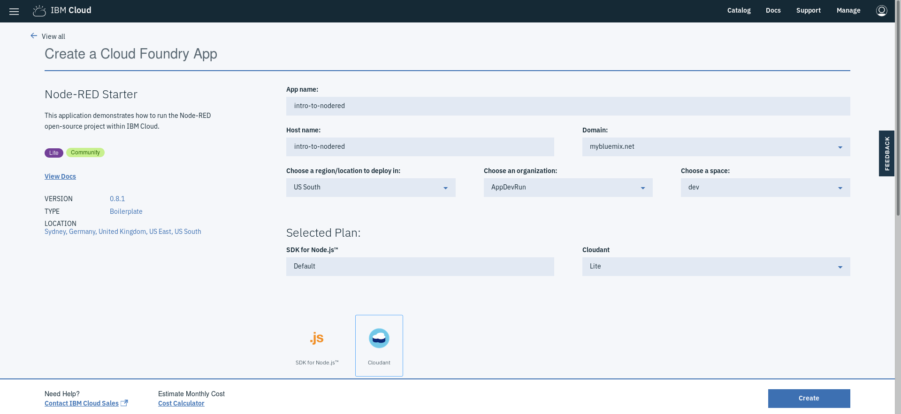

After clicking on **create**, an instance of the Node-RED application (which uses Node.js to create server-side JavaScript applications) is created to which a **Cloudant NoSQL** database is bound. It will take some time for the application status to change to **awake** or **Running**, indicating that it is running.

## Setting Up the Node-RED Application & a Quick Tour

* Go back to the **Dashboard** and click on the application you created earlier (in this example, it was called "intro-to-nodered") 
* In order to access the Node-RED editor used to build the application, click on **Visit App URL**.
* Follow the directions to access the Node-RED editor (you are encouraged to secure your Node-RED editor to ensure that only authorized users can access it)


* Click on **Go to your Node-RED flow editor**. This should open a fresh new flow in the Node-RED flow editor called *Flow 1*

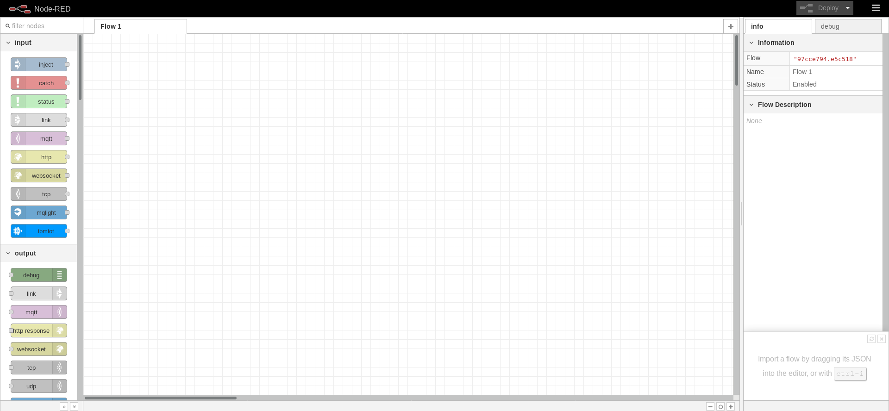

## Creating the Application
There are 2 parts to this application the web service part & the dashboard

### Creating the web service
* Start by editing the flow & calling it *Earthquake Details*
* Go to **Manage palette** to additional nodes. Look for **node-red-node-openweathermap** and **node-red-contrib-geonames** and install them
* Add the **HTTP input** & **HTTP response** nodes to the flow and edit **HTTP input** as follows to define an end-point (from this point on, in this subsection you will nodes between the **HTTP input** & **HTTP response** nodes)

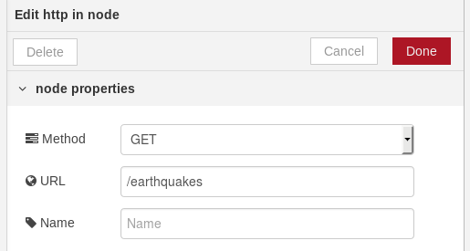

* Add a **change** node and modify it as follows

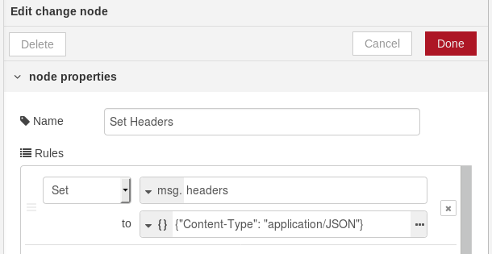

* Now, you will need to make the **[rsoeedis](https://www.npmjs.com/package/rsoeedis)** package available to the **function** node, which will pull earthquake information from RSOE EDIS.
* Deploy the changes done so far, go to the **IBM Cloud dashboard** and select the application you created
* Under **Overview**, click on **Enable** under **Continuous delivery** to, as the naming suggests, enable continous delivery
* Confirm all the details and click on **Create**
You can either clone the repository from **Git** and make the modifications that will be explained then push the application to the Cloud fot updates to be reflected or use **Eclipse Orion Web IDE**, which what will be used here.
* Click on **Eclipse Orion Web IDE** to open the online editor
* Go to bluemix-setting.js
* Find the definition of the **functionGlobalContext** object and add node-rsoeedis
```javascript
functionGlobalContext: { 
  rsoeedis:require('rsoeedis')
},
```
* Go to package.json file and define it as a dependency
```
"dependencies": {
  ...,
  "rsoeedis":"0.0.2"
},
```
* Go to Git in the editor, commit and push all changes
* Go back to the **IBM Cloud Dashboard** and go to your application and wait for your application to finish deploying (you can check that by looking at **Delivery Pipeline**)
* Open the NodeRED editor again to continue building your application
* After the **change** node we previously added, add a function node and add the following (notice how status, warn and error are used)
```javascript
var rsoeedis = global.get('rsoeedis');

const earthquakes = rsoeedis.RsoeEdisClient.earthquakes();

earthquakes.then(result => {
    node.status({fill:"yellow",shape:"dot",text:"geting rsoeedis earthquakes info"});
    node.warn("rsoeedis earthquakes info retrieved");
    node.status({});   // to clear the status
    
    //function needs to perform an asynchronous action before sending a message
    //it cannot return the message at the end of the function
    node.send({payload:result,req:msg.req,res:msg.res});

}).catch(error => {
    node.status({fill:"red",shape:"ring",text:"error"});
    node.error("Error!! ", error);
});
```
* Next, add a **change** node, where you will be setting the message payload to a JSONata expression as follows (JSONata is simply a querying language)
```
payload.{
"Type": Earthquake",
   "Continent":$replace(continent, " &amp;", ","),
   "Location": $join([location, state, country], ", "),
   "Magnitude": magnitude,
   "Radial Distance": $join([$string(
       $round($power(
           2.7182818284590452353602874713526624977572470936999595749669676277240766303535475945713821785251664274,
           magnitude / 1.01 - 0.13
       ),3)
   ), " km"]),
   "Source": source,
   "Event Date": eventDate
}
```
* Add a **split** node, which will split the earthquake information points into different messages based on the location
* Add a **change** node that will extract the location name, which will be fed into the **search place** node of GeoNames, which, in return, will provide the location's cooordinates (longitude & latitude)

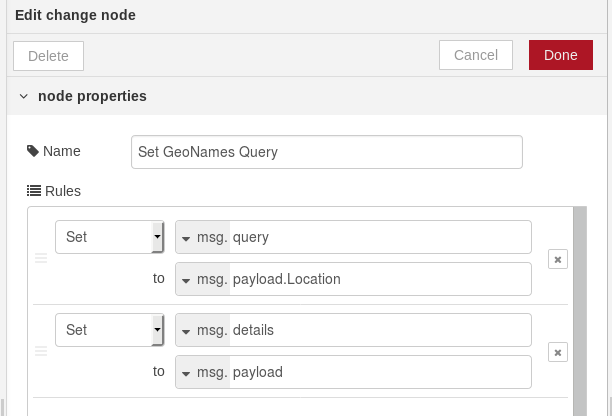

* Add **search place** node and modify as follows

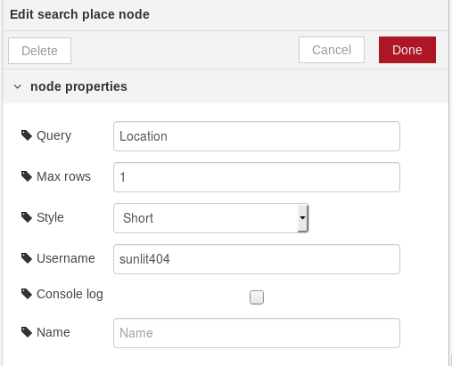

* Add **change** node to set the longitude and latitude to the right properties as need by the **openweathermap** node

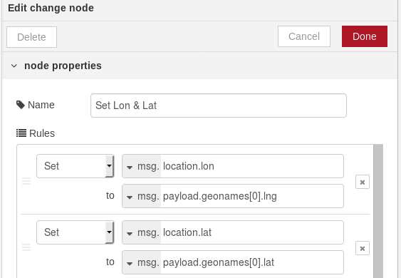

* Add openwethermap node to which you will be adding the API key from [here](https://home.openweathermap.org/api_keys) after 
creating an account
* Add another **change node** that will set the message payload to the output of a JSONata expression that will format things in the desired manner. The JSONata expression is as follows
```
{
   "name": parts.index,
   "Continent":details.Continent,
   "Location":details.Location,
   "Magnitude":details.Magnitude,
   "Radial Distance":details."Radial Distance",
   "Source":details.Source,
   "Event Date":details."Event Date",
   "longitude": data.coord.lon,
   "latitude":data.coord.lat,
   "Type":details.Type,
   "Temperature":data.main.temp,
   "Pressure":data.main.pressure,
   "Humidity":data.main.humidity,
   "Wind Speed":data.wind.speed,
   "Wind Direction":data.wind.deg,
   "Cloud Coverage":data.clouds.all,
   "SIDC" : "EONPAC------",
   "command":{
   "heatmap": {
        "gradient": {
            "0.1": "blue",
            "0.3": "green",
            "0.6": "orange",
            "0.9": "red"
        }
    }
   }
}
```
* Add a **join** node to join the previous split message into a single one again, which will be returned to a HTTP request
* Add a **change** node to remove any redundant properties

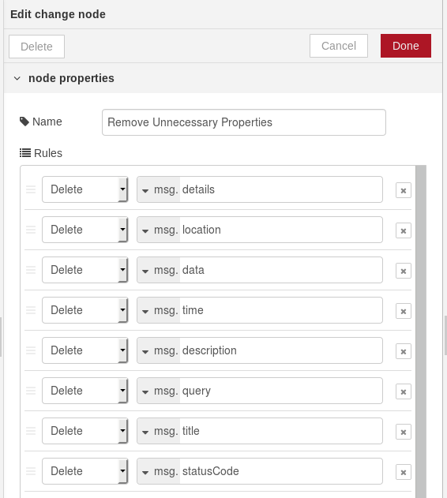

* The flow should look as follows


* After some cleaning up using **subflows** and **link** node, the flow will look as follows (**error** and **status** nodes were also added)

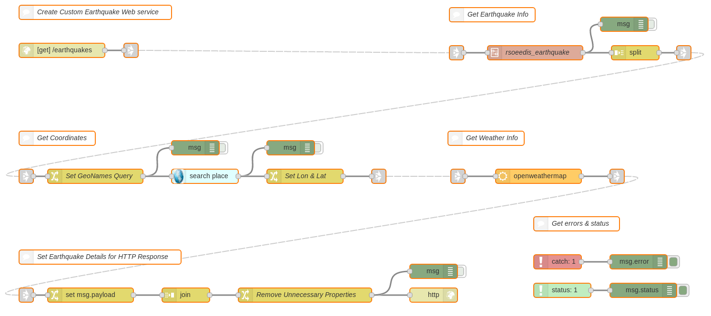

### Creating the Dashboard
* Edit the flow and name it *Dashboard*
* Go to **Manage palette** and install **node-red-contrib-web-worldmap** and **node-red-dashboard**. **node-red-contrib-web-worldmap** is used to create a map on which points corresponding to locations where earthquakes are taking place in the last 24 hours are plotted and **node-red-dashboard** to display latest earthquake related tweets and the frequency of earthquakes per continent
* Go to the **dashboard** tab that was added next to the **info** and **debug**. You will notice that there are 3 tabs, each used to change the look and feel of the UI
* Create a tab by clicking on **+tab**, which can resemble a page in the UI. Edit it 

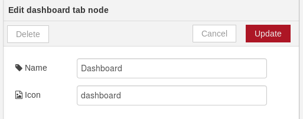

* Add a group, which is used to collate similar widgets together, to the tab by clicking on **+group**. 3 groups need to be added: one for the *Map*, one for *Latest tweet* and finally, one for *Earthquake Frequency*. One dashboard nodes are added, they will add to each of these groups.

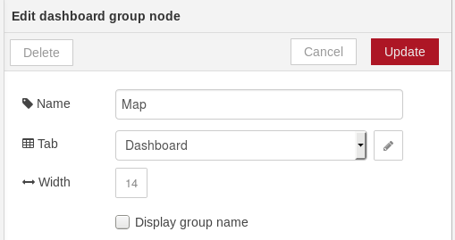

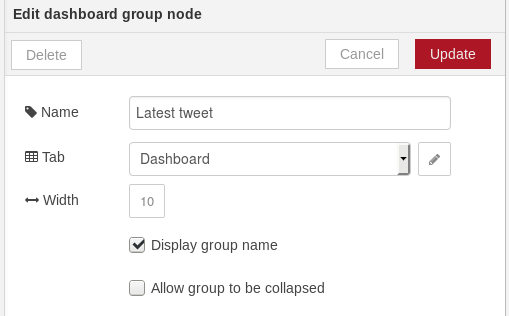

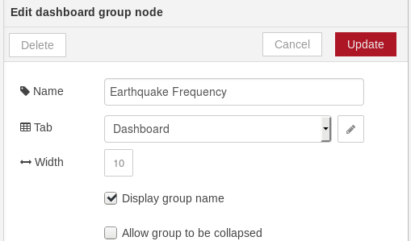

* Add an **inject** node that will inject a payload with an empty JSON object ({}), after deployment and every 60 minutes

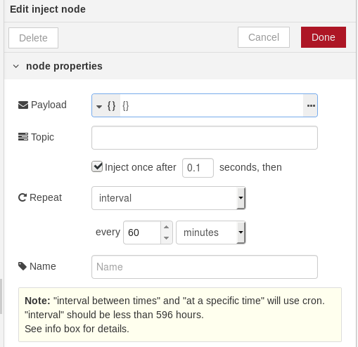

* Add a NodeRED **template** node and add the following, which reflects any changes in the */worldmap* end-point
```HTML
<iframe src="/worldmap" height=670 width=870></iframe>
```
* Add a Dashbord **template** node and edit it as follows

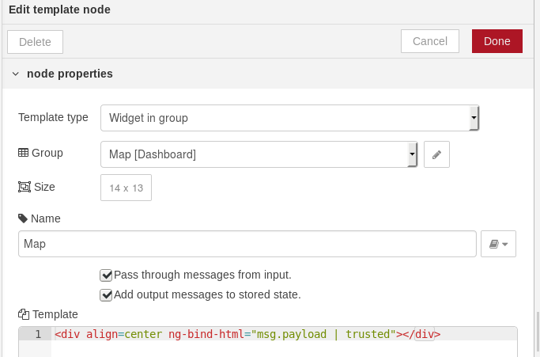

```HTML
<div align=center ng-bind-html="msg.payload | trusted"></div>
```

* In parallel, add an **HTTP request** node that will call the web service we created earlier. The data returned will be displayed on map through the *worldmap* endpoint, stored in a Cloudant database and analyzed to plot a chat of earthquake frequency per continent

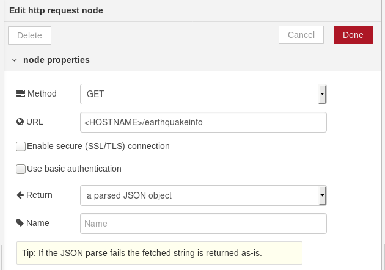

* Connect a **split** node to the **HTTP request** node, which will split the output of returned to plot each of the point representing a location. Keep the configuration of the node as default

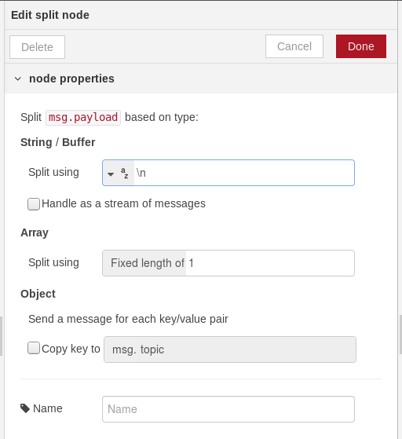

* Connect the **split** node to the **worldmap** node to plot each point on the web map and edit the node as follows:

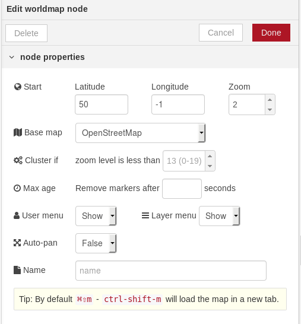

* Since we mentioned that the point will be stored, connect a **cloudant out** node to the previously added **HTTP request** node and configure it as seen below

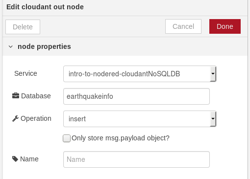

* Now, in order to plot the line chart to look at the earthquake frequency per continent, first, add a **change** node to filter out the continent names

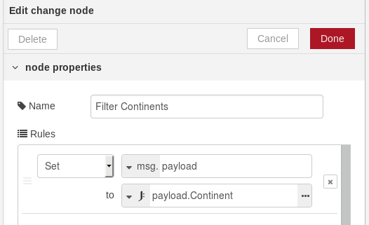

* To the **change node**, connect a function node, which will be counting the number of earthquakes currently happening per continent. In the function, add the following code
```javascript
var arr = msg.payload;

var counts = {};
for (var i = 0; i < arr.length; i++) {
    counts[arr[i]] = 1 + (counts[arr[i]] || 0);
}

msg.payload = counts;

return msg;
```
* Add another **function** node, which will calculate the actual frequency and will put the data in a form that can be fed into a Dashboard **chart** node. Moreover, modify the number of outputs coming out of the function to *9*.
```javascript
msg1 = {topic:"Australia, New-Zealand", payload:msg.payload["Australia, New-Zealand"]};
msg2 = {topic:"Asia", payload:msg.payload.Asia};
msg3 = {topic:"North-America", payload:msg.payload["North-America"]};
msg4 = {topic:"South-America", payload:msg.payload["South-America"]};
msg5 = {topic:"Europe", payload:msg.payload.Europe};
msg6 = {topic:"Africa", payload:msg.payload.Africa};
msg7 = {topic:"Antarctica", payload:msg.payload["Antarctica"]};

return [msg1, msg2, msg3, msg4, msg5, msg6, msg7];
```
* Connect the 9 outputs of the **function** node added in the previous step to a Dashboard **chart** node
* edit the **chart** node and set the node properties

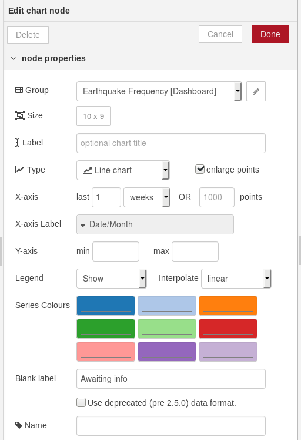

## Twitter Feed
* Add a **twitter in** node and configure the node to add a Twitter ID. After creating an app on *apps.twitter.com*, get the consumer key & secret and the access token and secret, which will also be added to the node.
* Search in **all public tweets** for *earthquake magnitude, earthquake hits*

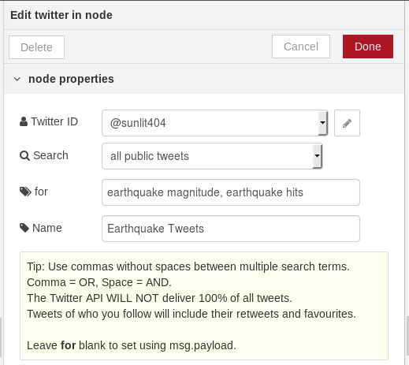

* Connect the **twitter in** node to a Dashboard text node and configure it

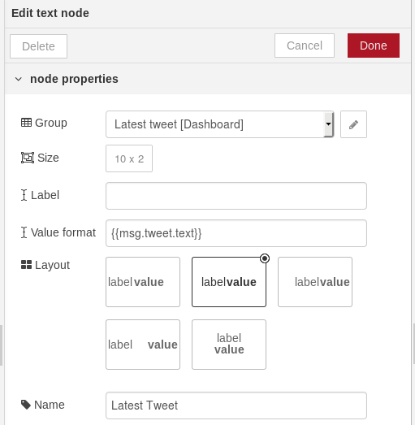

* After some cleaning up, the flow will look as follows

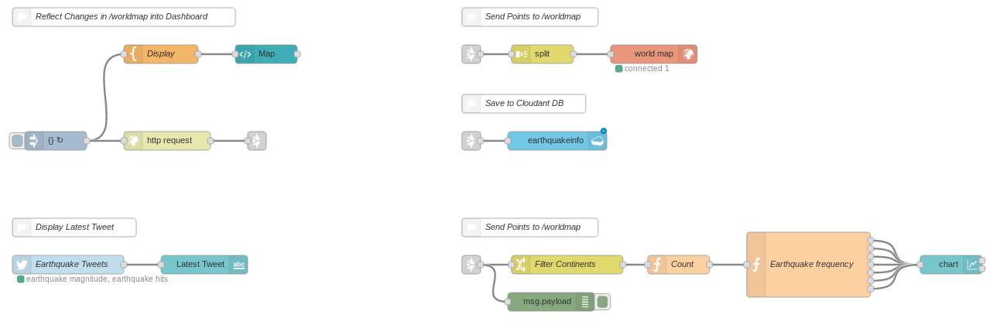

## Additional Resources to Explore

[RSOE EDIS Rest API](https://hisz.rsoe.hu/ws/)

[Creating a Node-RED deployment pipeline to IBM Cloud](https://medium.com/@knolleary/creating-a-node-red-deployment-pipeline-to-ibm-cloud-9a8e9d5113de)

[NodeRED roadmap](http://noderedguide.com/)

[Node-RED Whiteboard, Documentation Work, Design Notes, Technical Interchange Meetings](https://github.com/node-red/node-red/wiki)

[NodeRED documentation](https://nodered.org/docs/)

[NodeRED guide](http://noderedguide.com/)

[Dashboard template examples](https://it.knightnet.org.uk/kb/nr-qa/dashboard-template-examples/)

[NodeRED Angular HTTP](https://github.com/victorklijmeij/nod-red-angular-http/)

[Create a web interface using Node-RED to trigger an IBM Watson Studio analytics workflow](https://developer.ibm.com/code/patterns/orchestrate-data-science-workflows-using-node-red/)
